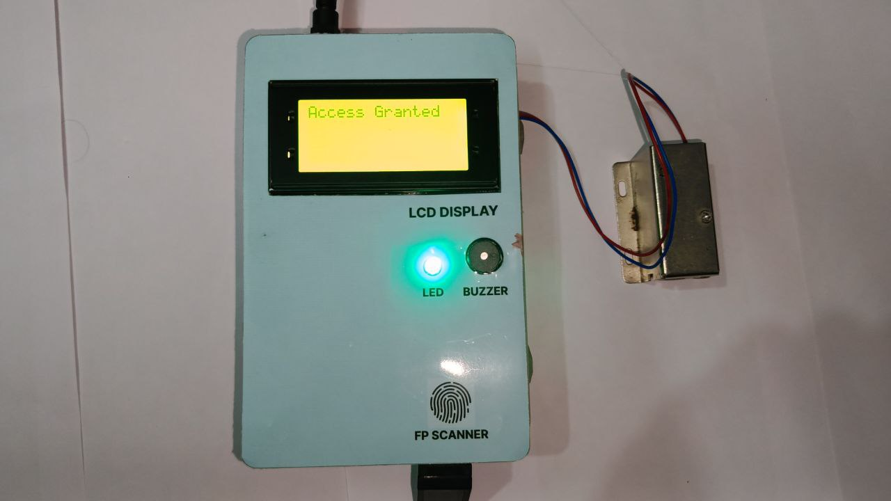

# Biometric-Door-Lock

### To make this Biometric Door Lock follow these steps

#### Components Used

> 1. Arduino UNO (You can use any other arduino board)
> 2. Fingerprint Sensor R307
> 3. 16*4 LCD (You can use 16*2)
> 4. Solenoid Door Lock (DO check the locking orientation while purchasing)
> 5. 5VDC Relay
> 6. RGB LED (I used common anode LED)
> 7. Buzzer
> 8. I2C module
> 9. Some Jumper Cables
> 10. Female DC jack
> 11. Power distribution board/ Buck Converter

- Install [Adafruit-Fingerprint-Sensor-Library](https://github.com/adafruit/Adafruit-Fingerprint-Sensor-Library), [LiquidCrystal_I2C](https://github.com/johnrickman/LiquidCrystal_I2C). After that make the connections as shown below.
- Now, go to file -> examples -> Adafruit-Fingerprint-Sensor-Library -> enroll (To enroll fingerprint(s)). *And follow the instructions from the ino file*. Upload the code open serial monitor and follow the instructions.
- After that, upload the [Finger_LCD.ino](Finger_LCD.ino).
- And boom!!! You r good to go......

  New Image ->
  
  Pinout Diagram ->
  
  Circuit Image ->
  
  Bare Minimum Circuit
  

## *Author*
Made With ❤️ By [Kuldeep](https://github.com/kuldeepaher01)
